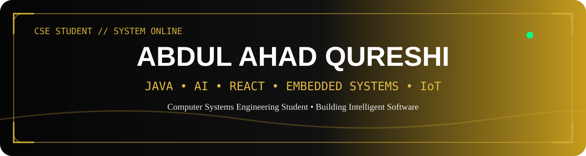
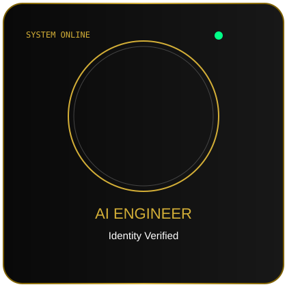

  

# 👋 Hi, I'm Abdul Ahad Qureshi

### Computer Systems Engineering Student • Software Developer • AI, Embedded Systems & IoT Enthusiast

<!-- Typing Animation -->

<!-- Social Buttons -->

---

<!-- 👇 YAHAN SCANNER AYEGA -->

---

# 💫 About Me

I'm **Abdul Ahad Qureshi**, a **Computer Systems Engineering** student at **Sukkur IBA University** who enjoys building practical software and intelligent systems that solve real-world problems.

My interests span across **Software Development**, **Artificial Intelligence**, **Embedded Systems**, and the **Internet of Things (IoT)**. I enjoy turning ideas into real applications while continuously improving my engineering, programming, and problem-solving skills.

Alongside my academic journey, I've worked on AI-powered desktop applications, embedded systems projects, hackathon solutions, and modern web applications. I'm always eager to learn new technologies and contribute to meaningful projects.

---

# 🎯 Current Focus

- 🧠 Developing AI-powered Desktop Applications
- 🌱 Mastering Data Structures & Algorithms (Java)
- ⚡ Exploring Embedded Systems & IoT
- 💻 Building React & TypeScript applications
- 🤝 Contributing to Open Source projects

---

# 🛠 Tech Stack

<!-- Tech Stack yahan aayega -->

---

# 💼 Experience

<!-- Experience -->

---

# 🚀 Featured Projects

<!-- AI Resume Builder -->

<!-- Portfolio -->

<!-- Robot Car -->

---

# 📊 GitHub Analytics

<!-- Stats -->

---

# 🏆 Certifications

---

# 🎓 Education

---

# 🌍 Connect With Me

---

# ⭐ Thanks for visiting!
